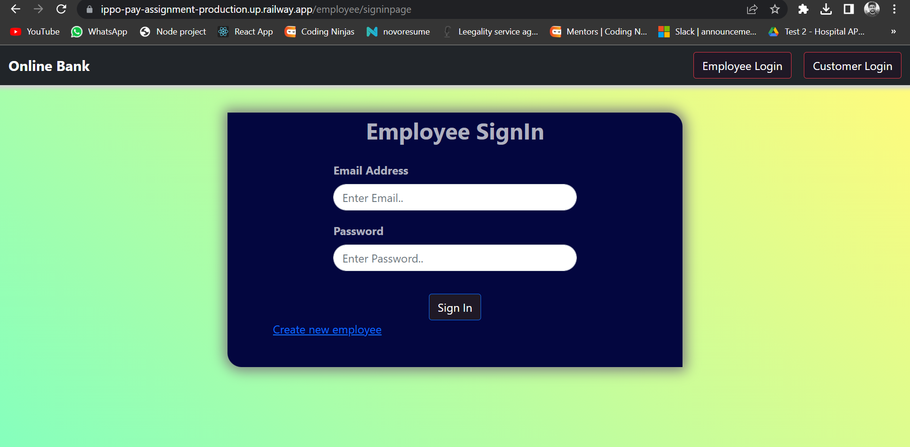
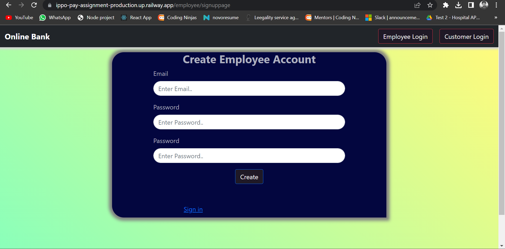
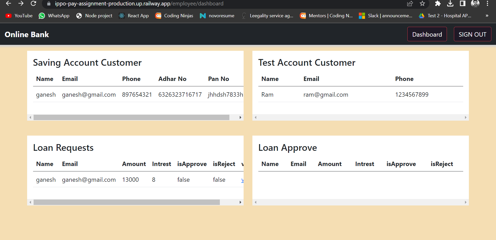
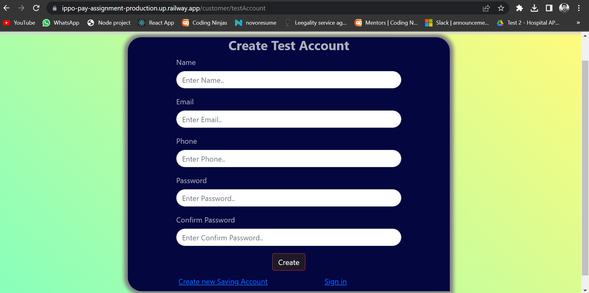
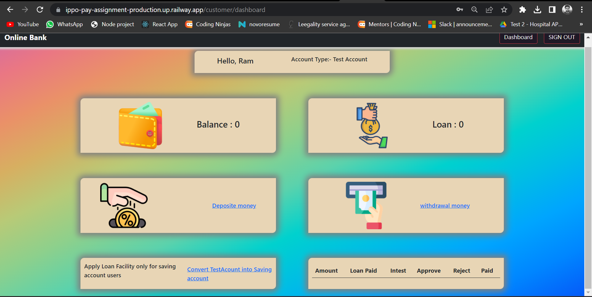
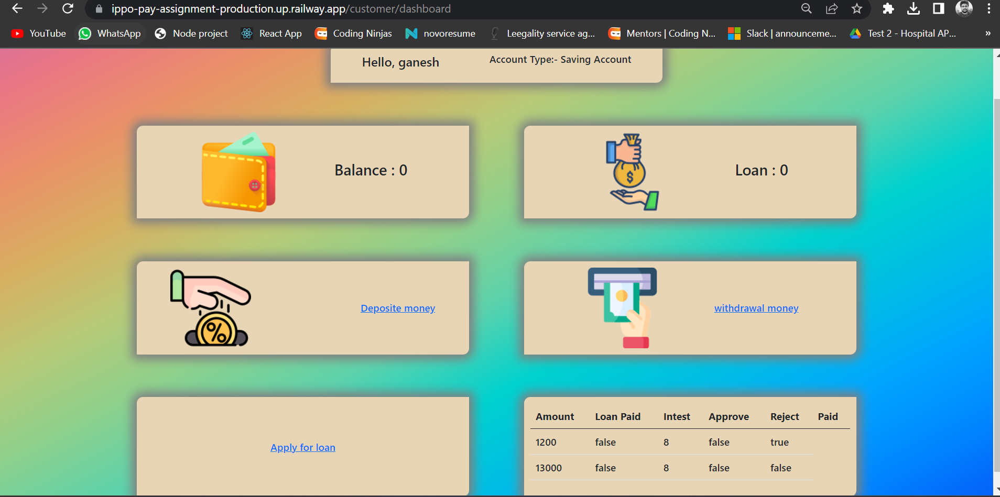
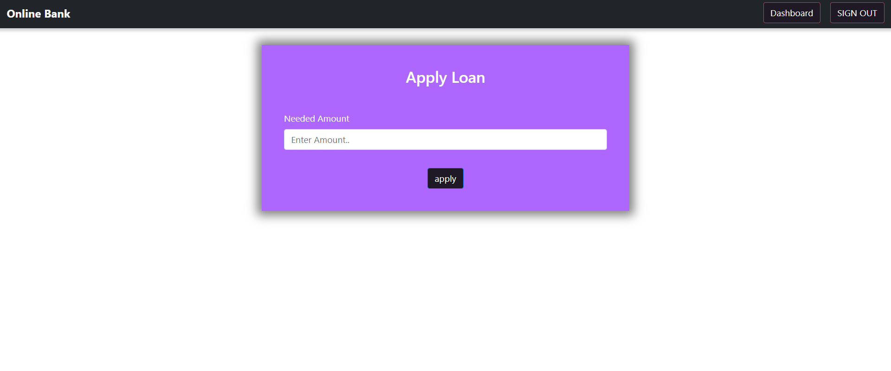
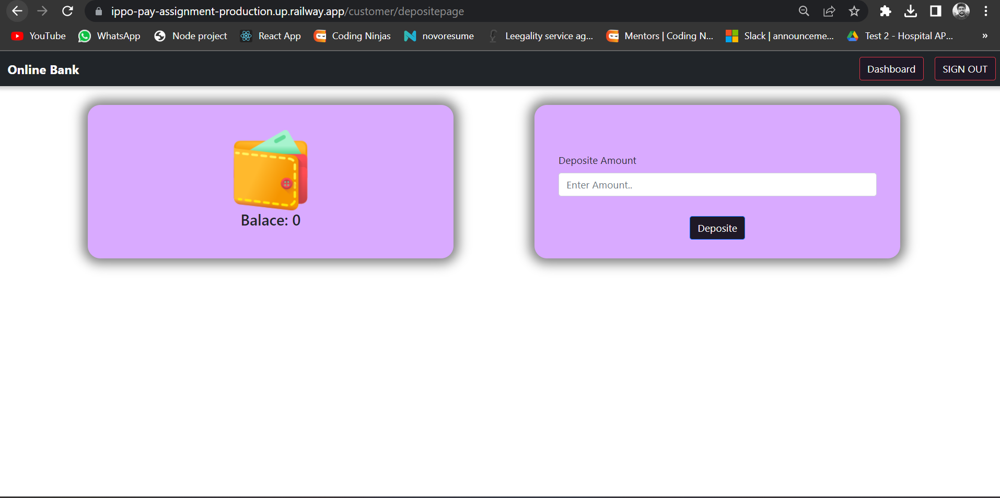
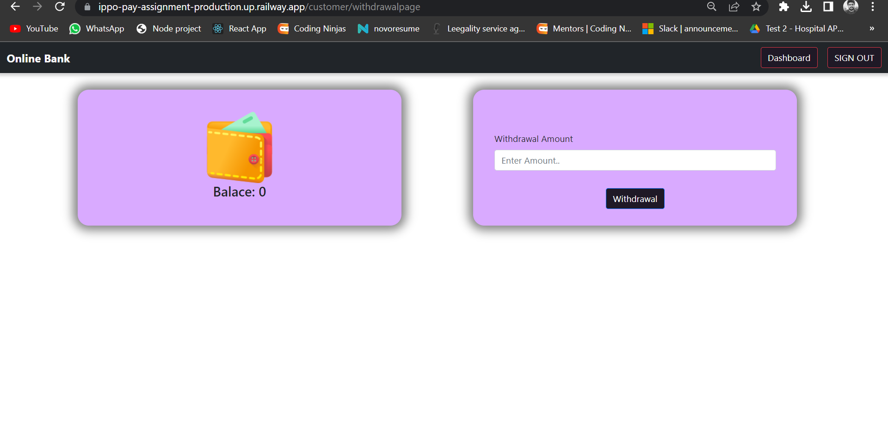

# Online bank (ippo-pay-assignment) 
Using this web application user can create test account as wel as saving account and saving account user can apply loan  

##Functionality
# User Bank Employee
1. Signin and Signup 
2. Check test user and Saving Account users
3. Approve Loan
    
# Test Account User
1. Signin and Signup 
2. Withdrowall and deposite amount 
3. Convert Test Account into Saving

# Saving Account User
1. Signin and Signup
2. Withdrowall and deposite amount
3. Apply Loan
  
##Tools

1. Node Js v-16.18.0
2. Express Js
3. Mongodb atlas
4. Mongoose
5. Ejs
6. Bootstrap 5
7. passport local (for authentication purpose)
8. express-session (for create,incript and store cookie)
9. connect-mongo (for storing cookie inside db)
10. connect-flash and noty (for display notification)

##Setup in Local System

1. git clone "https://github.com/tush8788/Online-Bank.git"
2. open command prompt and Type 'npm install' for download all dependencies
3. then just "npm start"/ if npm start is not work just run this command 'node index.js'
4. then go localhost:8000

#This Site is hosted on render
1. Access link "https://online-bank.onrender.com"

##Screen Short

1. Employee Sign In and Sign up Page

2. Employee Dashboard

3. Employee approve loan 

4. Customer Sign in

5. Test Account User Signup 

6. Test Account Dashboard

7. Saving Account Sign up

8. Saving Account Dashboard

9. Saving Account apply loan 

10. withdrawal and deposite

